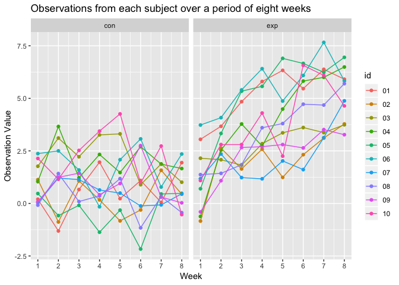
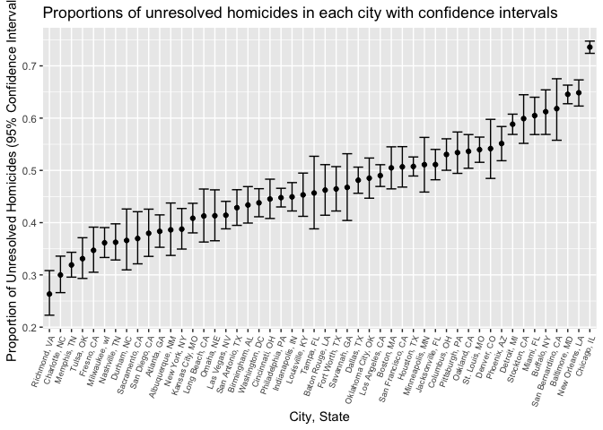

P8105\_hw5\_ykk2116
================
Yaa Klu
11/6/2018

*Loading tidyverse and
    rvest*

``` r
library(tidyverse)
```

    ## ── Attaching packages ────────────────────────────────────────────────────────────────────── tidyverse 1.2.1 ──

    ## ✔ ggplot2 3.0.0     ✔ purrr   0.2.5
    ## ✔ tibble  1.4.2     ✔ dplyr   0.7.6
    ## ✔ tidyr   0.8.1     ✔ stringr 1.3.1
    ## ✔ readr   1.1.1     ✔ forcats 0.3.0

    ## ── Conflicts ───────────────────────────────────────────────────────────────────────── tidyverse_conflicts() ──
    ## ✖ dplyr::filter() masks stats::filter()
    ## ✖ dplyr::lag()    masks stats::lag()

``` r
library(plotly)
```

    ## 
    ## Attaching package: 'plotly'

    ## The following object is masked from 'package:ggplot2':
    ## 
    ##     last_plot

    ## The following object is masked from 'package:stats':
    ## 
    ##     filter

    ## The following object is masked from 'package:graphics':
    ## 
    ##     layout

``` r
library(rvest)
```

    ## Loading required package: xml2

    ## 
    ## Attaching package: 'rvest'

    ## The following object is masked from 'package:purrr':
    ## 
    ##     pluck

    ## The following object is masked from 'package:readr':
    ## 
    ##     guess_encoding

### Problem 1

*Making dataframe containing all file
names*

``` r
allfiles_df = tibble(filepath = list.files("./data/", pattern = "*.csv", full.names = TRUE),
                     filename = basename(filepath))
```

*Function for data*

``` r
data_reading = function(data){
  
  read_csv(file = data)
}
```

*Iterating and reading in data for each subject, data
cleaning*

``` r
data_f = allfiles_df %>% mutate(data = purrr::map(allfiles_df$filepath, data_reading)) %>%
  unnest() %>% 
  select(-filepath) %>%
  gather(key = week, value = value, week_1:week_8) %>%
   mutate(id = str_replace(filename, ".csv",""),
         week = as.numeric(str_replace(week, "week_", ""))) %>%
    separate(id, into = c("group", "id"), sep = "_") %>% 
  mutate(id = as.factor(id))  
```

*Spaghetti
Graph*

``` r
ggplot(data_f, aes(x = week, y = value, color = id, group = id)) + geom_point() + geom_line() + facet_grid(~group) +
  scale_x_continuous(breaks = c(1, 2, 3, 4, 5, 6, 7, 8)) +
  labs(
     title = "Observations from each subject over a period of eight weeks",
    x = "Week",
    y = "Observation Value"
  )
```

<!-- -->

*Differences between experimental and control groups*

**Looking at all control subjects as a group, there was no clear trend
with time. Overall it seems that there was no difference between
observations at week 1 and week 8. In between the 8 weeks there were
random increases and decreases among specific subjects. In the
experimental arm, there was an increase in the observation value from
week 1 to week 8. In between the 8 weeks, there were some ups and downs
just as was observed in the control group. To conclude, the values of
observation were higher in the experimental arm after 8 weeks. However
in the control arm, the obervations at week 8 were similar to those at
week 1.**

### Problem 2

*Reading data and creating
variable*

``` r
homicide_data = read_csv("https://raw.githubusercontent.com/washingtonpost/data-homicides/master/homicide-data.csv", col_names = TRUE) %>% 
  mutate(city_state = str_c(city, ",", " ", state))
```

    ## Parsed with column specification:
    ## cols(
    ##   uid = col_character(),
    ##   reported_date = col_integer(),
    ##   victim_last = col_character(),
    ##   victim_first = col_character(),
    ##   victim_race = col_character(),
    ##   victim_age = col_character(),
    ##   victim_sex = col_character(),
    ##   city = col_character(),
    ##   state = col_character(),
    ##   lat = col_double(),
    ##   lon = col_double(),
    ##   disposition = col_character()
    ## )

*Description of raw data*

**The raw data contains 52,179 homicide records. The data is described
by 13 different variables including the race, sex, and age of victims
and the date of incident report. It also contains the first and last
names of victims and the state and city in which the homicide occured;
longitude and latitude information was also collected. The desposition
indicates whether the homicide case was closed without any arrest,
closed due to arrest or still open with no arrest.**

*Summarizing within cities to obtain the total number of homicides and
the number of unsolved homicides*

``` r
data_summary = homicide_data %>% 
  mutate(disposition = fct_collapse(homicide_data$disposition, "No arrest" = c("Closed without arrest","Open/No arrest"))) %>% group_by(city_state) %>% 
  count(disposition) %>% 
  spread(key = disposition, value = n) %>% 
  janitor::clean_names(dat = .) %>% 
  mutate(total = closed_by_arrest + no_arrest)
```

*Estimating the proportion of homicides in Baltimore that are
unresolved*

``` r
city_baltimore = data_summary %>% filter(city_state == "Baltimore, MD")

prop_baltimore = prop.test(city_baltimore$no_arrest, city_baltimore$total) %>% 
  broom::tidy() %>% 
  select(estimate, conf.low, conf.high) %>% 
  janitor::clean_names(dat = .) %>% 
  knitr::kable()
prop_baltimore
```

|  estimate | conf\_low | conf\_high |
| --------: | --------: | ---------: |
| 0.6455607 | 0.6275625 |  0.6631599 |

*Proportion of unsolved homicides and the confidence interval for each
city*

``` r
prop_test = function(data_table){
  try(prop.test(data_table$no_arrest, data_table$total) %>% 
    broom::tidy() %>% 
    select(estimate, conf.low, conf.high), silent = TRUE)
}
```

*Running a prop.test for each of the cities in the dataset, and
extracting both the proportion of unsolved homicides and the confidence
interval for each*

``` r
unresolved_homi = data_summary %>% 
  group_by(city_state) %>% nest() %>% 
  mutate(ci = map(data, prop_test)) %>% filter(city_state != "Tulsa, AL") %>% unnest() %>% 
  mutate(city_state = reorder(city_state, estimate)) %>% janitor::clean_names(dat = .)
```

*A plot that shows the proportions of unresolved homicides and CIs for
each city*

``` r
ggplot(unresolved_homi, aes(x = city_state, y = estimate )) + 
  geom_point() + geom_errorbar(aes(ymin = conf_low, ymax = conf_high)) + 
  theme(axis.text.x = element_text(angle = 70, hjust = 1, size = 7)) +
  labs(
    title = "Proportions of unresolved homicides in each city with confidence intervals",
    x = "City, State",
    y = "Proportion of Unresolved Homicides (95% Confidence Interval)"
  )
```

<!-- -->
